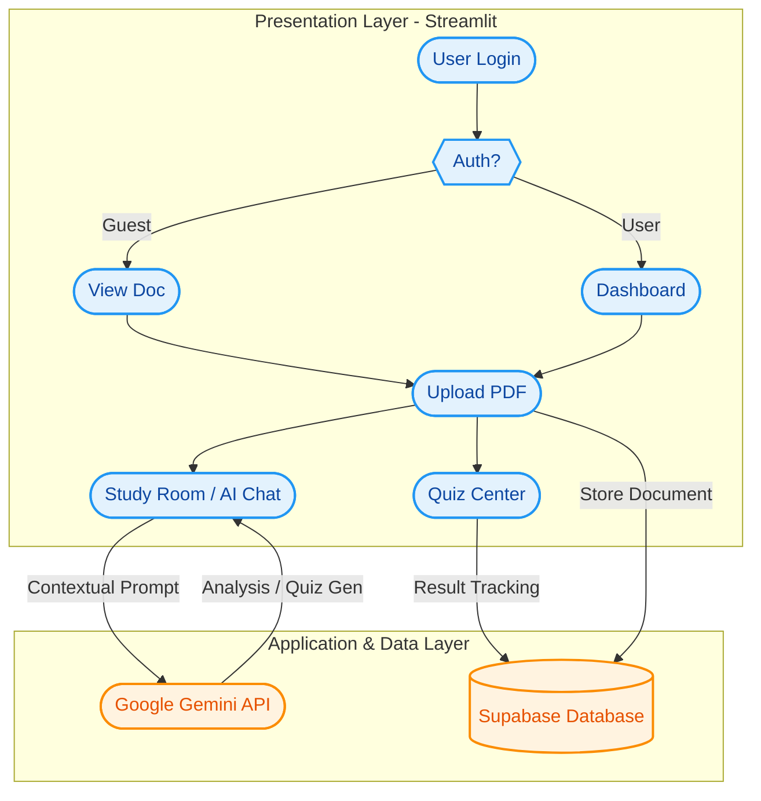

# 🎓 AI Study Buddy 2026

Turn any PDF or note into a personalized, interactive learning experience.

AI Study Buddy is an intelligent study platform that leverages **Google Gemini** to transform dense academic materials into structured study guides, flashcards, and adaptive, error-tracking quiz sessions.

## 🚀 Live Demo
Access the application here: [Insert Your Streamlit Cloud Link Here]

## ✨ Core Features
* **Intelligent Ingestion:** Upload PDFs or paste raw text; our system instantly processes and structures your notes.
* **The Vault:** A secure document library that recognizes previously uploaded materials using file-hashing, saving you time and AI resources.
* **AI Tutor:** Engage in context-aware, streaming chat sessions with your documents to get deep, step-by-step explanations.
* **Dynamic Study Guides:** Auto-generated executive summaries and interactive flip-card style flashcards for active recall.
* **Adaptive Quiz Center:** Generate 5-question multiple-choice quizzes that track your performance and offer targeted practice on your "Danger Zones."
* **Learning Analytics:** Visualize your knowledge growth with real-time trend charts and a "Mistake Inbox" that logs and reviews your incorrect answers.
* **Multi-Language Support:** Seamlessly toggle your study environment between English and Bahasa Indonesia.

## 🛠️ Tech Stack
* **Frontend:** Streamlit
* **AI Engine:** Google Gemini (Generative AI SDK)
* **Database:** Supabase (Cloud-native relational storage for users, documents, and chat history)
* **Processing:** PyPDF2, gTTS (Google Text-to-Speech), and Pandas

## Architecture Diagram



## 💻 Local Setup
If you would like to run or develop this project locally:

1. **Clone the repository:**
   ```bash
   ```git clone [https://github.com/yourusername/ai-study-assistant.git](https://github.com/yourusername/ai-study-assistant.git)
   ```cd ai-study-assistant```

2. **Create a virtual environment (recommended):**
   ```bash

   # On Windows
   ```python -m venv venv
   ```venv\Scripts\activate

   ```# On macOS/Linux
   python3 -m venv venv
   source venv/bin/activate

   Install dependencies:
   ```bash
   ```pip install -r requirements.txt


### Why this works better:
* **Separation:** By placing the `git clone` command inside its own code block (the lines with triple backticks), you ensure the Markdown renderer treats it as a single, copy-pasteable command.
* **Clarity:** It clearly separates the Windows commands from the macOS/Linux commands, preventing confusion for anyone else (or your future self) who tries to set up the project.